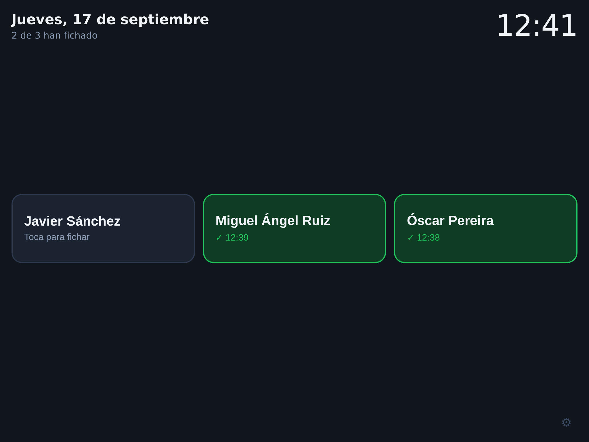
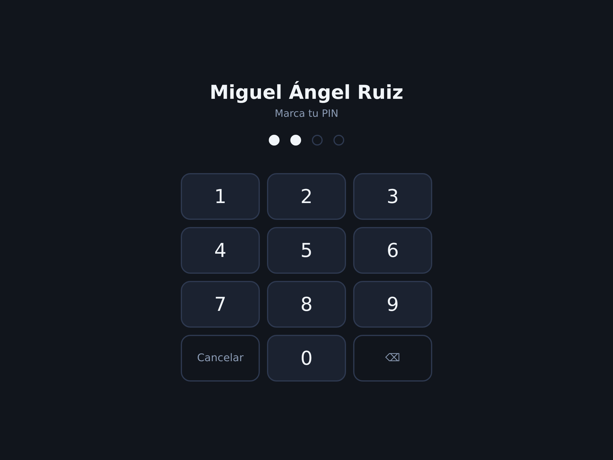
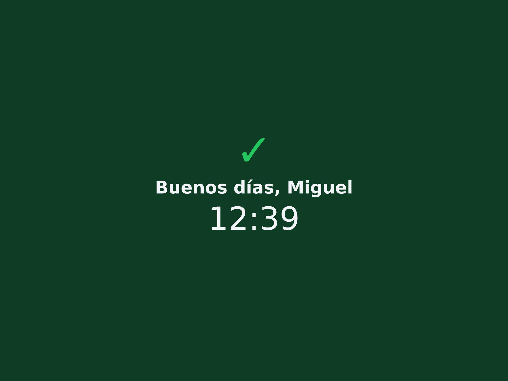

# fichalba

Fichaje de entrada para el taller de **JS Integral del Motor**. Una tablet colgada en la
pared: cada trabajador toca su nombre, marca su PIN y queda registrada la hora de entrada.
Nada más.



| Marcar el PIN | Fichado |
|---|---|
|  |  |

## Cómo se usa

1. La tablet enseña los nombres. Los que ya han fichado salen **en verde con su hora**.
2. Tocas tu nombre → marcas tu PIN de 4 cifras → "Buenos días, Javier — 08:02".
3. A los cuatro segundos vuelve sola a la lista.

El jefe entra en `/admin` con su PIN y ve los fichajes del día, se descarga el mes en CSV
y da de alta o de baja a la gente.

## Ponerlo en marcha

No hay dependencias que instalar: sólo hace falta **Node 22 o superior**.

```bash
npm run trabajador -- admin 4821            # tu PIN de administrador
npm run trabajador -- alta "Javier Sánchez" 1111
npm run trabajador -- alta "Óscar Pereira"  2222
npm start                                    # http://localhost:3000
```

La base de datos es **un único fichero**, `datos/fichalba.db`. La copia de seguridad es
copiar ese fichero.

| Variable | Para qué | Por defecto |
|---|---|---|
| `FICHALBA_PUERTO` | Puerto | `3000` |
| `FICHALBA_BD` | Dónde se guarda la base de datos | `datos/fichalba.db` |
| `FICHALBA_TZ` | Zona horaria del taller | `Europe/Madrid` |
| `FICHALBA_RED` | Si se define, sólo se ficha desde esas IPs (`192.168.1.,88.12.34.56`) | sin restricción |
| `FICHALBA_TRAS_PROXY` | `1` si hay un proxy delante (Caddy, nginx) | `0` |

```bash
npm test          # las reglas que no se pueden romper
```

## Las tres cosas que no se negocian

1. **Un fichaje no se modifica ni se borra.** Nunca. Si está mal, el administrador lo
   *anula* dejando el motivo: el original se queda en la base de datos para siempre. No es
   una promesa del código, lo impide la propia base de datos con disparadores — y hay una
   prueba automática que lo comprueba.
2. **La hora es la del servidor.** El reloj que se ve en la tablet lo manda el servidor, así
   que aunque el iPad tenga la hora mal puesta, lo que se ve y lo que se guarda coinciden.
3. **La tablet no guarda nada.** Ni nombres, ni PIN, ni fichajes. Todo vive en el servidor.

## Documentación

| Documento | Qué contiene |
|---|---|
| [`docs/TABLET.md`](docs/TABLET.md) | **Dejar el iPad clavado en el fichaje** y **cómo evitar que se fichen unos a otros** (incluido por qué la huella no sirve para esto) |
| [`docs/PROYECTO-FICHAJES.md`](docs/PROYECTO-FICHAJES.md) | El planteamiento completo: legalidad, RGPD, arquitectura |
| [`docs/ESTRUCTURA.md`](docs/ESTRUCTURA.md) | El diseño de la versión completa |
| [`docs/MODELO-DATOS.md`](docs/MODELO-DATOS.md) | El modelo de datos completo, con correcciones y cadena de integridad |
| [`docs/FASE-0-GESTORIA.md`](docs/FASE-0-GESTORIA.md) | Lo que hay que preguntar a la gestoría |
| [`docs/referencia/esquema-completo.sql`](docs/referencia/esquema-completo.sql) | El esquema completo, para cuando haga falta. Hoy **no se usa** |

## Dónde está esto, de verdad

Esto **registra la entrada y ya**. Para cumplir el art. 34.9 del Estatuto de los Trabajadores
falta registrar también la **salida**, y sacar un **resumen mensual**. Está a medio camino a
propósito: primero que la gente se acostumbre a tocar su nombre al entrar; lo demás se añade
encima sin rehacer nada (la tabla `fichaje` ya distingue entrada de salida).

Lo que hay hoy, y lo que falta:

- [x] Fichar la entrada desde la tablet, con PIN
- [x] Ver quién ha fichado y a qué hora
- [x] Anular un fichaje equivocado sin borrar el original
- [x] Alta y baja de trabajadores, cambio de PIN
- [x] Descargar los fichajes en CSV
- [ ] Fichar la salida  ← lo siguiente, cuando lo pidas
- [ ] Resumen mensual en PDF por trabajador
- [ ] Los tres documentos de RGPD (fase 0, con la gestoría)
