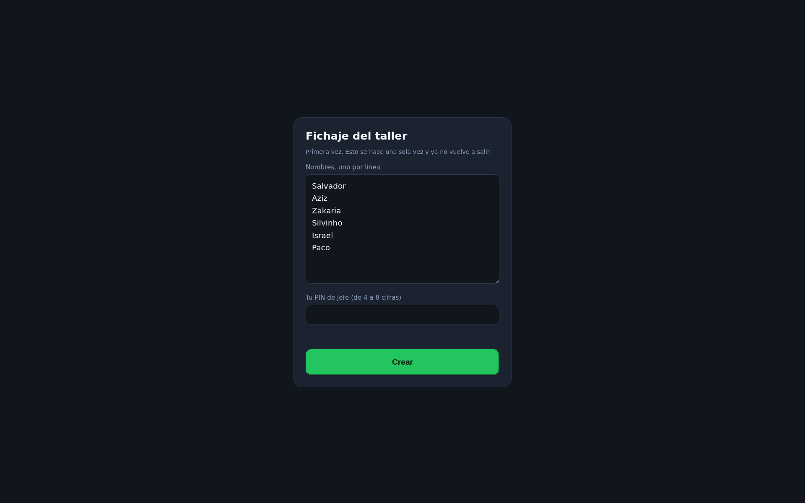
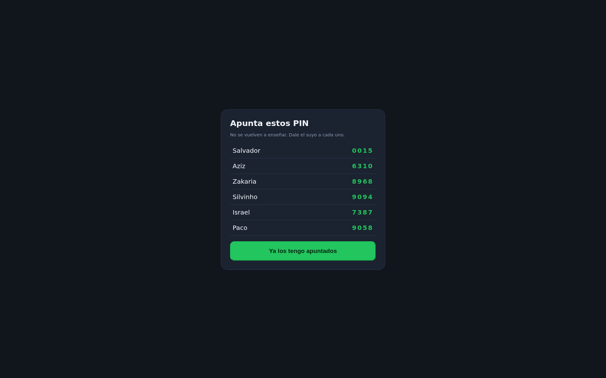
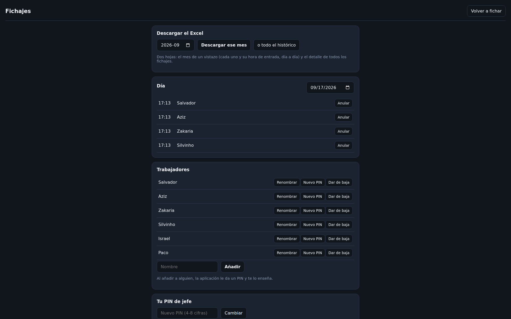

# fichalba

Fichaje de entrada para **JS Integral del Motor**. Una página web que se instala en la tablet
del taller y funciona **dentro de ella**: sin servidor, sin ordenador encendido, sin cuotas y
sin internet una vez instalada.


Tocas tu nombre → marcas tu PIN → *"Buenos días, Salvador — 08:02"*. A los cuatro segundos
vuelve sola a la lista. Quien ya fichó sale en verde con su hora, a la vista de todos.

| Marcar el PIN | Fichado |
|---|---|
|  |  |

## Cómo se pone en marcha

Todo está en **[docs/EMPEZAR.md](docs/EMPEZAR.md)**, y son tres pasos: publicar la página,
abrirla en la tablet e instalarla, y dejar la tablet clavada en ella. Media hora larga
contando el café.

La primera vez que se abre pide los nombres y tu PIN de jefe, reparte un PIN a cada uno y te
los enseña **una sola vez**. Eso es toda la instalación.

| Primera vez | Los PIN, una sola vez |
|---|---|
|  |  |

## La pantalla del jefe

Se entra con el engranaje de la esquina y tu PIN. Nadie más pasa de ahí.



- **Descargar el Excel** del mes (o todo el histórico).
- **Ver el día** y anular un fichaje equivocado dejando el motivo.
- **Añadir gente, renombrar, dar un PIN nuevo o dar de baja.**

## Dónde está la información

Dentro de la tablet, y sale de ahí con el botón de Excel. Una página web no puede tener un
fichero Excel abierto y escribir en él sola —eso no existe en Android—, así que los fichajes
se van guardando dentro y el Excel te lo da cuando lo pidas, con todo lo que haya hasta ese
momento. Dos hojas:

- **El mes de un vistazo**: una fila por trabajador, una columna por día, y en cada casilla
  la hora a la que entró.
- **Los fichajes uno a uno**: fecha, día de la semana, hora, quién, y si alguno se anuló,
  con su motivo.

**Descárgalo de vez en cuando y guárdalo** (Drive, el correo, un pendrive). Ese fichero es el
registro que pide la ley, y es lo que te queda si un día la tablet se pierde o se borra.

## Las tres cosas que no se negocian

1. **Un fichaje no se modifica ni se borra.** Si está mal, se *anula* dejando el motivo: el
   original se queda guardado y sigue apareciendo en el Excel, tachado y con su explicación.
2. **La hora es la del taller.** Se guarda en formato universal y se enseña en hora española,
   así que el cambio de hora de marzo y octubre no descuadra nada.
3. **Nadie ve los PIN.** De cada PIN se guarda sólo una huella cifrada. Ni tú puedes leerlos:
   si alguien pierde el suyo, se le da otro.

## Para quien toque el código

```bash
npm test          # 18 pruebas de lo que no puede fallar
npm run app       # abre app/ en http://localhost:4200 para probarla en el ordenador
```

Sin dependencias: la aplicación son ocho ficheros de JavaScript, HTML y CSS. El `.xlsx` se
genera dentro del navegador escribiendo el ZIP a mano, y las reglas del fichaje viven en
`app/logica.js` como funciones puras, que es lo que prueba `npm test`.

| Carpeta | Qué es |
|---|---|
| [`app/`](app/) | **La aplicación.** Es lo único que se usa |
| [`docs/`](docs/) | Cómo empezar, la tablet, y el planteamiento legal |
| [`servidor/`](servidor/) | La versión con servidor, aparcada. Ver [su README](servidor/README.md) |

## Documentación

| Documento | Qué contiene |
|---|---|
| [`docs/EMPEZAR.md`](docs/EMPEZAR.md) | **Empieza por aquí**: publicar, instalar en la tablet y el primer día con la gente |
| [`docs/TABLET.md`](docs/TABLET.md) | La **Galaxy Tab Active5**: dejarla clavada en el fichaje y por qué la huella no sirve para identificar a nadie |
| [`docs/PROYECTO-FICHAJES.md`](docs/PROYECTO-FICHAJES.md) | El planteamiento: legalidad, RGPD, fases |
| [`docs/FASE-0-GESTORIA.md`](docs/FASE-0-GESTORIA.md) | Lo que hay que preguntar a la gestoría |
| [`docs/MODELO-DATOS.md`](docs/MODELO-DATOS.md) y [`docs/ESTRUCTURA.md`](docs/ESTRUCTURA.md) | El diseño completo, para cuando esto se quede corto |

## Dónde queda esto

Registra **la entrada**, y ya. Para cumplir el art. 34.9 del Estatuto de los Trabajadores
falta registrar también la **salida**. Está así a propósito: primero que la gente se
acostumbre a tocar su nombre al entrar.

- [x] Fichar la entrada, con PIN, desde la tablet
- [x] Ver quién ha fichado y a qué hora
- [x] Anular un fichaje equivocado sin borrar el original
- [x] Añadir gente, renombrar, PIN nuevo, dar de baja
- [x] Descargar el mes (o todo) en Excel
- [x] Funciona sin wifi y sin cobertura
- [ ] Fichar la salida ← lo siguiente, cuando lo pidas
- [ ] Los tres papeles de RGPD (con la gestoría)
