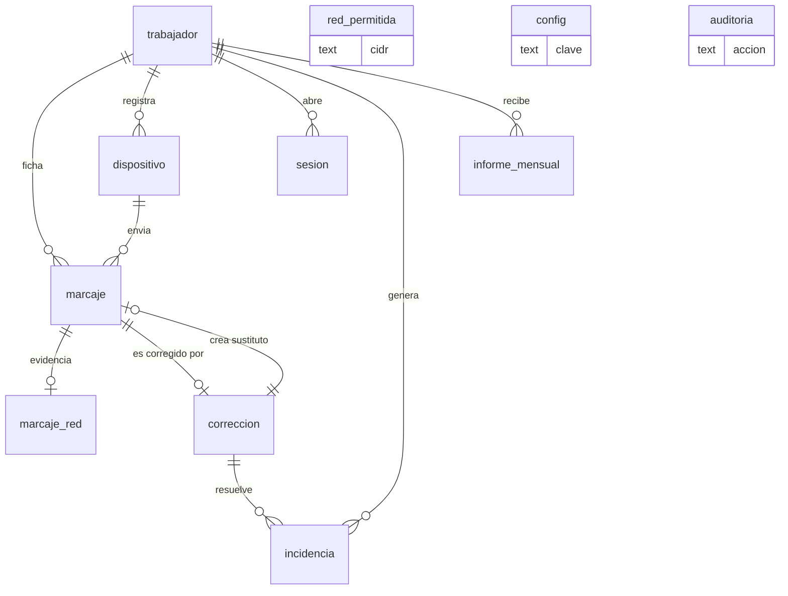

# Modelo de datos — fase 1 (jornada)

> **Nota (17/09/2026):** este documento describe la versión **completa** del registro de
> jornada, que está aparcada. Lo que hay construido y funcionando hoy es la versión pequeña
> de la tablet — ver el [README](../README.md). Esto se mantiene como el sitio al que volver
> cuando toque añadir salidas, correcciones y mensual en PDF.

Esquema ejecutable: [`docs/referencia/esquema-completo.sql`](referencia/esquema-completo.sql).
Este documento explica **por qué** es así y cuáles son las reglas que el código debe respetar.

---

## 1. Los seis principios

1. **Un marcaje es un hecho, no un estado.** No se guarda "Ana está dentro"; se guardan los
   hechos "Ana entró a las 8:02" y "Ana salió a las 13:30". Que Ana esté dentro se *calcula*.
   Un estado se sobrescribe y se pierde; un hecho, no.
2. **`marcaje` y `correccion` son de sólo inserción.** No hay `UPDATE` ni `DELETE`, y lo
   impiden disparadores de la propia base de datos. Ésta es la traducción literal de
   "fiable e inalterable" del art. 34.9 ET.
3. **Corregir es añadir.** Una corrección deja el original donde estaba y añade: qué se
   cambia, por qué, quién y cuándo. Siempre se puede reconstruir lo que decía el registro en
   cualquier fecha pasada.
4. **La jornada se calcula, no se almacena.** No hay tabla `jornada`: las horas trabajadas
   salen de los marcajes vigentes cada vez que se piden. Un total guardado se desincroniza
   en cuanto hay una corrección; un total calculado, nunca.
5. **Lo legal y lo interno, separados.** Jornada (esta fase) y orden de trabajo (fase 2) no
   comparten tabla ni se tocan. Corregir una imputación de OT jamás debe rozar el registro
   de jornada.
6. **Se guarda lo mínimo.** Se registra el *veredicto* "estaba en el wifi del taller", no un
   rastro de dónde estaba nadie. La IP vive en una tabla aparte y se purga al año.

---

## 2. Mapa



| Tabla | Qué guarda | ¿Se modifica? |
|---|---|---|
| `trabajador` | Personas, rol, PIN | Sí (altas, bajas, PIN) |
| `dispositivo` | Móviles y tablet autorizados | Sí (revocación) |
| `sesion` | Sesiones abiertas | Sí |
| `red_permitida` | IP pública del wifi del taller | Sí |
| **`marcaje`** | **Los fichajes. El registro legal** | **NUNCA** |
| `marcaje_red` | IP y navegador del fichaje | Sólo para purgar |
| **`correccion`** | **El rastro de cada cambio** | **NUNCA** |
| `incidencia` | Olvidos y anomalías a resolver | Sí (es gestión) |
| `informe_mensual` | Cada PDF generado, con su hash | Sólo se añade |
| `auditoria` | Quién hizo qué | Sólo se añade |
| `config` | Parámetros del taller | Sí |

---

## 3. `marcaje`, campo a campo

| Campo | Para qué está |
|---|---|
| `id_cliente` | UUID que genera el móvil **antes** de enviar. Es lo que hace segura la cola offline: si el envío se reintenta tres veces, las tres traen el mismo UUID y sólo entra una fila. Sin esto, cada corte de cobertura crearía fichajes duplicados. |
| `tipo` | `ENTRADA`, `SALIDA`, `PAUSA_INICIO`, `PAUSA_FIN`. Nada más. |
| `instante_utc` | La hora canónica. **Todos** los cálculos usan ésta. |
| `instante_local` | La misma hora ya escrita en hora española con su desfase (`+02:00`). Redundante a propósito: es lo que se imprimió en el informe, y así el PDF de hace tres años se puede reproducir exactamente aunque cambien las reglas del horario de verano. |
| `fecha_jornada` | El día al que cuenta el fichaje (ver §5). Es lo que hace que una jornada que cruza medianoche no se parta en dos. |
| `origen` | `MOVIL`, `TABLET` o `CORRECCION`. Un marcaje nacido de una corrección se distingue siempre del que hizo el trabajador. |
| `red` | `TALLER` / `FUERA` / `DESCONOCIDA`. El veredicto, no las coordenadas. |
| `reloj` | `SERVIDOR` cuando había conexión (hora de confianza) o `DISPOSITIVO` cuando el fichaje venía de la cola offline (hora del móvil, que puede estar mal o manipulada). Es la diferencia entre un dato fiable y uno que el administrador debería mirar. |
| `registrado_utc` | Cuándo llegó al servidor. Si difiere mucho de `instante_utc`, es un fichaje diferido. |
| `autor_id` | El administrador, sólo si `origen = 'CORRECCION'`. La base de datos obliga a que ambas cosas vayan juntas. |
| `hash_anterior`, `hash` | La cadena de integridad (§7). |

**No hay campo `estado`.** Un marcaje anulado no se marca: deja de aparecer en la vista
`v_marcaje_vigente` porque existe una `correccion` que lo señala. Así la tabla base no se
toca jamás.

---

## 4. Secuencia válida

El servidor rechaza los fichajes imposibles **antes** de insertarlos:

```
            ┌───────────────── SALIDA ──────────────┐
            │                                       ▼
  FUERA ── ENTRADA ──► DENTRO ── PAUSA_INICIO ──► EN PAUSA
                          ▲                          │
                          └──── PAUSA_FIN ───────────┘
```

| Estado actual | Se permite | Se rechaza |
|---|---|---|
| Fuera | `ENTRADA` | todo lo demás |
| Dentro | `SALIDA`, `PAUSA_INICIO` | `ENTRADA`, `PAUSA_FIN` |
| En pausa | `PAUSA_FIN`, `SALIDA` | `ENTRADA`, `PAUSA_INICIO` |

`SALIDA` estando en pausa se acepta (se cierra la pausa a la misma hora) porque en el taller
pasa: sales a comer, te llaman de casa y ya no vuelves. Mejor registrarlo que perderlo.

Dos excepciones que **no** se rechazan, se registran y se marcan como incidencia:

- **Fichaje diferido de la cola offline** que llega desordenado. Se guarda igual: perder un
  fichaje es peor que guardar uno raro.
- **Doble pulsación** (mismo tipo, mismo trabajador, menos de 60 segundos): se devuelve el
  marcaje anterior sin crear otro. El dedo gordo con guantes es un caso real.

---

## 5. La fecha de la jornada

`fecha_jornada` es el día local de la **`ENTRADA` que abrió la jornada**. Los marcajes
siguientes heredan esa fecha hasta la `SALIDA`.

Ejemplo: entra el 11 a las 22:00 y sale el 12 a las 02:00 → los cuatro marcajes llevan
`fecha_jornada = '2026-09-11'` y el mensual de septiembre cuenta 4 horas el día 11. Sin este
campo, la salida caería en el día 12 y ningún informe cuadraría.

Si llega una `SALIDA` sin `ENTRADA` abierta, `fecha_jornada` es el día local del propio
marcaje y se abre incidencia `SECUENCIA_INVALIDA`.

**Cambio de hora.** Todo se calcula en UTC, así que la madrugada de octubre con dos horas
"03:00" y la de marzo sin "02:00" se resuelven solas. En el PDF se imprime `instante_local`,
que lleva su desfase, y por eso una jornada de la noche del cambio suma 1 hora más (o menos)
que la diferencia de relojes. Es lo correcto y hay que probarlo con un test.

---

## 6. La comprobación de red

En cada fichaje el servidor compara la IP pública de la petición con `red_permitida`:

- coincide → `red = 'TALLER'`
- no coincide → `red = 'FUERA'`
- no se puede determinar → `red = 'DESCONOCIDA'`

**Por defecto no se bloquea** (`config.exigir_red_taller = 'aviso'`): el fichaje se registra
y se abre incidencia `FUERA_DE_RED` para que el administrador la mire. El motivo es
importante: registrar la jornada es una **obligación de la empresa**, no un premio. Un
sistema que impide fichar a quien está trabajando incumple la ley, y encima empuja a apuntar
horas en un papel. Se registra todo y se revisa lo raro.

Está el modo `'bloquear'` por si la gestoría lo exige, pero mi recomendación es `aviso`.

Limitación honesta: esto demuestra que el fichaje **salió de la conexión del taller**, no que
la persona esté físicamente dentro. Una VPN o compartir datos desde otro móvil lo burla. Para
un taller de 8 personas donde todos se ven las caras, es proporcionado y suficiente; si
hiciera falta más, el paso siguiente sería un lector NFC en la tablet, no el GPS.

---

## 7. La cadena de integridad

Cada marcaje guarda el hash del anterior. Cambiar una fila en la base de datos a mano rompe
la cadena de esa fila en adelante, y `scripts/verificar-cadena.ts` lo detecta.

```
hash = SHA-256( hash_anterior + "|" + id_cliente + "|" + trabajador_id + "|" + tipo
                + "|" + instante_utc + "|" + fecha_jornada + "|" + origen + "|" + red
                + "|" + reloj + "|" + registrado_utc + "|" + IFNULL(autor_id,"") )
```

- Cadena **única para toda la tabla**, en orden de inserción. La primera fila usa 64 ceros.
- Se calcula dentro de la misma transacción que inserta, leyendo el último `hash`.
- `correccion` tiene su propia cadena, con la misma fórmula sobre sus campos.
- La IP **no entra** en la fórmula: por eso se puede purgar sin romper nada.

Esto no convierte la base de datos en un blockchain ni lo pretende: quien tenga acceso de
administrador al servidor puede recalcular la cadena entera. Lo que aporta es que **la
manipulación deja de ser silenciosa**: hay que alterar la copia de seguridad diaria, la
verificación nocturna y el PDF ya entregado. Para una inspección, eso es exactamente la
diferencia entre un registro defendible y un Excel.

---

## 8. Corregir: los tres casos

Siempre: motivo obligatorio (mínimo 10 caracteres), autor y fecha.

**a) Falta un fichaje** (`ALTA`) — se marchó sin fichar la salida.

```
marcaje    #41  SALIDA 13:30  origen=CORRECCION  autor=jefe
correccion #7   tipo=ALTA  afectado=NULL  nuevo=#41
                motivo="olvidó fichar la salida, confirmado con el parte del día"
```

**b) La hora está mal** (`MODIFICACION`) — fichó a las 8:15 pero entró a las 8:00.

```
marcaje    #12  ENTRADA 08:15  origen=MOVIL        ← sigue ahí, intacto, para siempre
marcaje    #42  ENTRADA 08:00  origen=CORRECCION
correccion #8   tipo=MODIFICACION  afectado=#12  nuevo=#42
                motivo="el móvil no tenía cobertura al llegar, entró a las 8:00"
```

`#12` desaparece de `v_marcaje_vigente` pero se puede enseñar cuando haga falta.

**c) Sobra un fichaje** (`ANULACION`) — dio dos veces al botón con un minuto de diferencia.

```
correccion #9   tipo=ANULACION  afectado=#13  nuevo=NULL
                motivo="pulsación duplicada, ya existe la entrada #12"
```

Un índice único garantiza que **cada marcaje se corrige como máximo una vez**: corregir una
corrección afecta al sustituto, formando una cadena `#12 → #42 → #57` que se lee entera.

---

## 9. Cómo se calculan las horas

En `src/dominio/jornada.ts`, función pura: entra una lista ordenada de marcajes vigentes de
un trabajador y un día; sale la jornada.

```
minutos_presencia = SALIDA − ENTRADA
minutos_pausa     = Σ (PAUSA_FIN − PAUSA_INICIO)
minutos_trabajados = minutos_presencia − minutos_pausa      ← lo que va al informe
```

- Jornada sin `SALIDA` al cerrar el día: **no se inventa la hora**. Se deja abierta, cuenta
  0 minutos trabajados y se abre incidencia `SIN_SALIDA`. Cuando alguien la corrige, los
  minutos aparecen.
- Pausa sin cierre: igual, incidencia `PAUSA_ABIERTA`.
- Si `minutos_presencia` supera `config.jornada_max_horas` (12 por defecto), incidencia
  `JORNADA_LARGA`. No se corta nada, sólo se avisa.

El mensual suma los días, y el PDF imprime: día, entrada, salida, pausas, total del día,
total del mes, y una nota por cada corrección que afecte al mes. La corrección aparece **en
el propio informe**: es lo que espera ver la Inspección.

---

## 10. Conservación y borrado

| Dato | Cuánto se guarda | Luego |
|---|---|---|
| `marcaje`, `correccion`, `informe_mensual` | **4 años** desde el fin del año natural | `scripts/purgar.ts`, desactivado por defecto y con confirmación explícita |
| `marcaje_red.ip_origen`, `user_agent` | 12 meses | Se vacía el campo (`purgado_utc`), el marcaje sigue intacto |
| `auditoria` | 4 años | Igual que los marcajes |
| `sesion` caducadas | 90 días | Se borran |
| Trabajador que causa baja | Sus datos siguen mientras sus marcajes deban conservarse | Se anonimiza junto con sus marcajes al purgar |

La purga es **manual y deliberada**. Un cron que borra registros legales solo es una forma
elegante de tener un problema dentro de cuatro años.

---

## 11. El hueco de la fase 2

Cuando entre la imputación a orden de trabajo, se añade **una tabla nueva** y no se toca
ninguna de éstas:

```sql
CREATE TABLE imputacion (
  id             INTEGER PRIMARY KEY,
  trabajador_id  INTEGER NOT NULL REFERENCES trabajador(id),
  ot_externa     TEXT NOT NULL,      -- identificador de la OT en driver360
  matricula      TEXT,
  inicio_utc     TEXT NOT NULL,
  fin_utc        TEXT,
  fecha_jornada  TEXT NOT NULL,
  ...                                -- ésta SÍ se puede editar y borrar
);
```

Se relaciona con la jornada por `(trabajador_id, fecha_jornada)` y por solapamiento de horas,
nunca por clave ajena a `marcaje`. Así se puede borrar y rehacer una imputación mal metida
sin que el registro legal se entere de nada.
